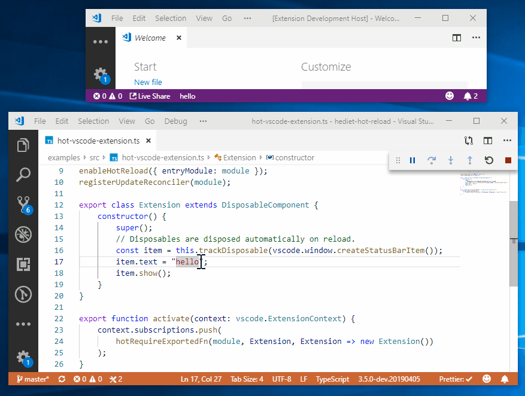

# Hot Reloading for NodeJS

[](https://twitter.com/intent/follow?screen_name=hediet_dev)

A thoughtfully designed library that brings advanced hot reloading to NodeJS.

## Features

-   Tracks a dependency graph (files in `node_modules` and there like can be ignored).
-   Tracked files are watched for changes.
-   If a file has changed, reconcilers try to apply the change to the running app on a module basis.
-   If a reconciler is not successful, the reconcilers of the dependees are asked to apply the change.
-   The `Update Reconciler` provides functions to propagate reloaded items to the original items.
-   The `Steps Execution System` implements function level hot reload.

## Usage

### Installation

```
yarn add @hediet/node-reload
```

or

```
npm install @hediet/node-reload --save
```

See the `./examples` folder for detailed examples.
Works best with TypeScript.

### Plain Hot Require

`hotRequire` is the way to go if you just want to watch
a module and its dependencies for changes.

```ts
import { enableHotReload, hotRequire } from "@hediet/node-reload";

// Call `enableHotReload` to track dependencies and watch for file changes.
enableHotReload();

hotRequire<typeof import("./dep")>(module, "./dep", cur => {
	// Runs immediately or when `dep` (or any dependency of `dep`) changes.
	console.log("value of x: ", cur.x);
});
```

### Hot Require Exported Items

`hotRequireExportedFn` makes it very easy to track changes of exported functions and classes.

```ts
import {
	registerUpdateReconciler,
	hotRequireExportedFn,
	getReloadCount,
	enableHotReload,
} from "@hediet/node-reload";

enableHotReload();
// Call `registerUpdateReconciler` to mark this module as reconcilable.
// If this module (or any dependency that could not be reconciled) changes,
// the `UpdateReconciler` is asked to apply the new module to the old.
// The `UpdateReconciler` powers `getReloadCount`, `hotRequireExportedFn`,
// `runExportedSteps` and other functions.
registerUpdateReconciler(module);

export function foo(arg: string) {
	console.log(arg + " change me");
}

if (getReloadCount(module) === 0) {
	// only cause side effect on initial load as the entire module is run again on each reload
	hotRequireExportedFn(module, foo, { hasFnChanged: "useSource" }, foo => {
		// is called immediately and whenever the source of `foo` changes.
		foo();
		return { dispose: () => console.log("Free any resources from last invocation"); };
	});
}
```

### Vs Code Extension Reloading

With `hotRequireExportedFn` you can easily make your VS Code Extension really hot. Note how the status bar updates:



```ts
import {
	enableHotReload,
	hotRequireExportedFn,
	registerUpdateReconciler,
} from "@hediet/node-reload";
import { DisposableComponent } from "@hediet/std/disposable";
import * as vscode from "vscode";

if (isDevMode()) {
	enableHotReload({ entryModule: module });
}
registerUpdateReconciler(module);

export class Extension extends DisposableComponent {
	constructor() {
		super();

		// Disposables are disposed automatically on reload.
		const item = this.trackDisposable(vscode.window.createStatusBarItem());
		item.text = "Hallo Welt";
		item.show();
	}
}

export function activate(context: vscode.ExtensionContext) {
	context.subscriptions.push(
		hotRequireExportedFn(module, Extension, Extension => new Extension())
	);
}
```

### Steps Execution System

The steps execution system is especially useful in connection with `puppeteer`. See the `./examples` folder on how to use this with `puppeteer`.

The system however is independent from any libraries:

```ts
enableHotReload();
registerUpdateReconciler(module);
// Runs the given steps and applies updates by unwinding already executed steps and running the new steps.
// Unchanged last steps are run on initial load,
// unwound when steps before them change, but only run again when they or a step after them changes.
// This way you can edit and hot reload intermediate steps without running all steps again after every change.
runExportedSteps(module, getSteps);

export function getSteps(): Steps {
	return steps(
		{
			id: "start",
			run: async (args, { onRewind }) => {
				await slowLog("start");
				onRewind(() => slowLog("undo start"));
				return { data: 9 };
			},
		},
		{
			id: "continue1",
			run: async (args, { onRewind }) => {
				await slowLog("continue 1");
				onRewind(() => slowLog("undo 1"));
				return { data2: 10, ...args };
			},
		},
		{
			id: "continue2",
			run: async (args, { onRewind }) => {
				await slowLog("continue 2");
				onRewind(() => slowLog("undo 2"));
				return {};
			},
		}
	);
}
```

There is also the [vscode extension "Node Reload Steps Execution State Visualizer"](https://marketplace.visualstudio.com/items?itemName=hediet.node-reload-steps-vscode) that displays the current executation state when debugging such an application:


You can even use vscode to run a specific step:


## Similar libs

-   [node-hot](https://github.com/mihe/node-hot): Inspired this library.

## Changelog

-   0.0.2 - Initial release.
